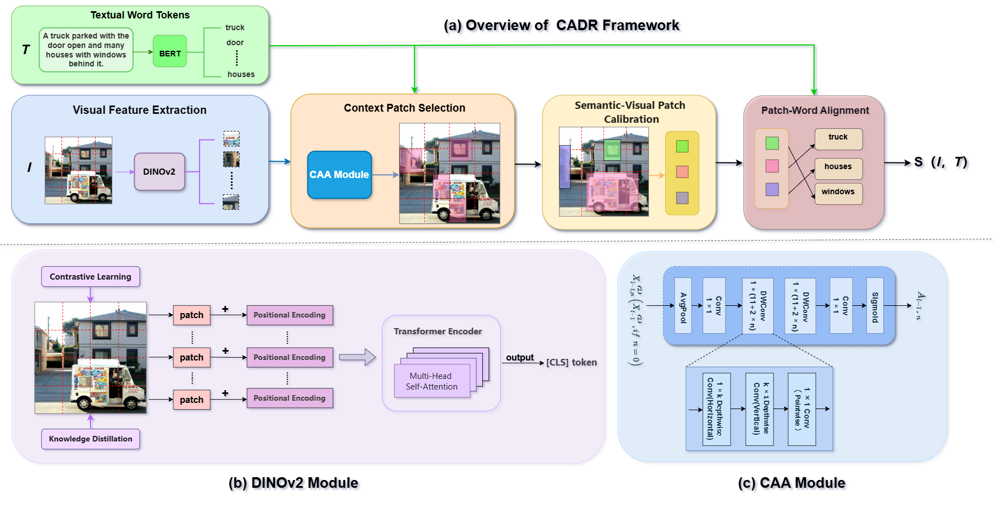

# CADR: Image-Text Retrieval Framework Based on Context Anchor Attention and DINOv2
## Introductiom

Cross-modal retrieval aims to bridge the gap between vision and language.The key lies in how to effectively learn the semantic similarity between images and text. For images containing complex scenes, traditional fine-grained alignment methods are difficult to fully capture the association information between visual fragments and text words, leading to problems such as redundancy of visual fragments and alignment error. 

<div align=center>

</div>

   In this paper, we propose a new image-text retrieval framework based on Context Anchor Attention and DINOv2, known as CADR, to achieve fine-grained alignment. Specifically, we utilize DINOv2 as an image encoder to extract richer feature representations. Additionally, we introduce context anchor attention to implement a long-range context capture mechanism. This mechanism serves to enhance the understanding of the overall semantics of images, enabling us to identify visual patches associated with text more efficiently and accurately. 

## Preparation

### Environments
We recommended the following dependencies:
- python >= 3.8
- torch >= 1.12.0
- torchvision >= 0.13.0
- transformers >=4.32.0
- opencv-python
- tensorboard
- tensorflow

### Datasets
We have prepared the caption files for two datasets in  `data/` folder, hence you just need to download the images of the datasets. 
The Flickr30K (f30k) images can be downloaded in [flickr30k-images](https://www.kaggle.com/datasets/hsankesara/flickr-image-dataset). The MSCOCO (coco) images can be downloaded in [train2014](http://images.cocodataset.org/zips/train2014.zip), and [val2014](http://images.cocodataset.org/zips/val2014.zip).
We hope that the final data are organized as follows: 

```bash
data
├── coco  # coco captions
│   ├── train_ids.txt
│   ├── train_caps.txt
│   ├── testall_ids.txt
│   ├── testall_caps.txt
│   └── id_mapping.json
│
├── f30k  # f30k captions
│   ├── train_ids.txt
│   ├── train_caps.txt
│   ├── test_ids.txt
│   ├── test_caps.txt
│   └── id_mapping.json
│
├── flickr30k-images # f30k images
│
├── coco-images # coco images
│   ├── train2014
│   └── val2014
```

### Model Weights
Our framework needs to get the pre-trained weights for [BERT-base](https://huggingface.co/bert-base-uncased) and [DINOv2](https://huggingface.co/facebook/dinov2-base) models. You also can choose the weights downloaded by [transformers](https://github.com/huggingface/transformers) automatically (the weights will be downloaded at  `~/.cache`).


## Training
First, we set up the arguments, detailed information about the arguments is shown in ```arguments.py```.
```bash
--dataset: the chosen datasets, e.g., f30k and coco.
--data_path: the root path of datasets, e.g., data/.
--multi_gpu: whether to use the multiple GPUs (DDP) to train the models.
--gpu-id, the chosen GPU number, e.g., 0-7.
--logger_name, the path of logger files, e.g., runs/f30k_test or runs/coco_test
```

Then, we run the ```train.py``` for model training. The models need about 20,000 GPU-Memory (one 3090 GPU) when batch size = 64. You need to modify the batch size according to the hardware conditions, and we also support the multiple GPUs training. 
```bash

## single GPU

### f30k
python train.py --dataset f30k --gpu-id 0

### coco
python train.py --dataset coco --gpu-id 0

## multiple GPUs

### f30k 
CUDA_VISIBLE_DEVICES=0,1 python -m torch.distributed.run --nproc_per_node=2 train.py --dataset f30k --multi_gpu 1 --logger_name runs/f30k --batch_size 64

### coco
CUDA_VISIBLE_DEVICES=0,1,2,3 python -m torch.distributed.run --nproc_per_node=4 train.py --dataset coco --multi_gpu 1 --logger_name runs/coco --batch_size 64

```

## Evaluation
Run ```eval.py``` to evaluate the trained models on f30k or coco datasets, and you need to specify the model paths.
```bash
python eval.py --dataset f30k --data_path data/ --gpu-id 0
python eval.py --dataset coco --data_path data/ --gpu-id 1
```
## Performances
The following tables show the reproducing results of cross-modal retrieval on MSCOCO and Flickr30K datasets. We provide the training logs, checkpoints, performances, and hyper-parameters.

| Datasets | Visual encoders | I-T R@1 | I-T R@5 | T-I R@1 | T-I R@5 | Model checkpoint |
|:---:|:---:|:---:|:---:|:---:|:---:|:---:|
| Flickr30K | DINOv2 | 84.3 | 98.3 | 71.9 | 92.7 |[Link](https://drive.google.com/drive/folders/1FDSZ2_uZzJIRk4xQph4ZIu-jfD8FSoQA?usp=sharing) |
| MSCOCO-1K | DINOv2 | 82.6 | 97.2 | 70.9 | 93.7 |[Link](https://drive.google.com/drive/folders/12XT_gZLPCvuGs503HToworv8DNGuwonk?usp=sharing) |


